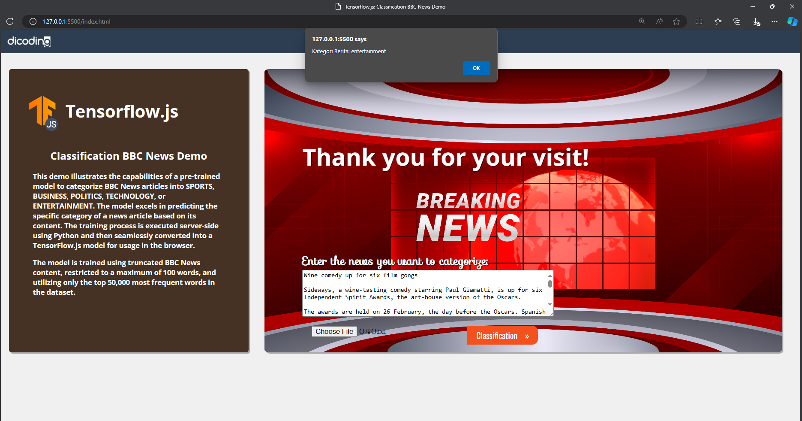

# Machine Learning Colab Projects 🤖

This repository houses exciting Colab projects covering a spectrum of machine learning tasks, including Natural Language Processing (NLP), time series prediction, and image classification.

## 1. Natural Language Processing (NLP) Project: BBC News Categorization 📰

In this NLP venture, the objective is to masterfully categorize BBC News articles into sports, business, politics, technology, or entertainment. Unleash the power of cutting-edge NLP techniques to unravel insights from textual data.

**Dataset Source:** [BBC News Dataset](http://mlg.ucd.ie/datasets/bbc.html)

## 2. Time Series Prediction Project: Daily Gold Price Prediction 📈

Embark on a journey of forecasting with the time series prediction project, where the focus is on predicting daily gold prices. Leverage sophisticated time series analysis and machine learning algorithms to build models that unveil the mysteries of future trends in gold prices.

## 3. Image Classification Project: Classification of 6 Animals 🐾

Explore the world of computer vision through this image classification project, training models to distinguish images among six animal categories—butterfly, cat, chicken, cow, elephant, and squirrel—utilizing the [Animal10 Dataset](https://www.kaggle.com/datasets/viratkothari/animal10.)

Feel free to navigate through each project folder for comprehensive documentation, code, and datasets related to these captivating machine learning endeavors.

Happy coding! 🚀
